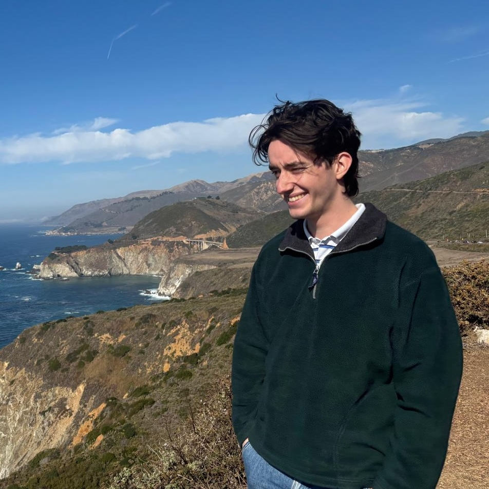

Mathematics grad student @ TU Delft. Currently in Toronto for six months on research exchange.

## Contact and socials
[Twitter](https://twitter.com/LourensTouwen)
-- [GitHub](https://github.com/LourensT/)
-- [LinkedIn](https://www.linkedin.com/in/touwenlourens/)
-- [touwenlourens[at]gmail.com](mailto:touwenlourens[at]gmail.com)

## Research
Preprint paper: Learning the mechanisms of network growth, L. Touwen, D. Bucur, R. van der Hofstad, A. Garavaglia, N. Litvak, 2024,  [https://arxiv.org/abs/2404.00793](https://arxiv.org/abs/2404.00793)

Currently visiting student researcher at Toronto Metropolitan University, working on Graph Embeddings, GNNs and doing some random graph stuff. 

## Some projects 
* Data-mined political compass of the Dutch congressional chamber: https://github.com/LourensT/tweede-kamer-politiek-kompas 
* [Webshop](https://www.fromscribbletoreadable.com): From Scribble To Readable,
    * A notebook containing the guide to writing mathematical symbols like you're in kindergarten. This was my COVID summer project with Tristan Trouwen. [Fun article about the whole thing](https://www.cursor.tue.nl/nieuws/2020/juli/week-2/studenten-proberen-onleesbare-handschriften-uit-te-bannen-met-boekje/)
* Previously: student team: Team HART
HART is university and industry-funded team of ~18 students.  We develop a sleeve that can give haptic feedback representing any type of information. The user learns to interpret these vibrations, effectively learning a new sense. Our first application allows the user to understand a foreign language, live. I joined HART as the first generation of students after the founders in early 2021, and left in February 2022. Some media highlights:
    * [AD: Studenten in Eindhoven bedenken trilmouw](https://www.ad.nl/wetenschap/studenten-in-eindhoven-bedenken-trilmouw-waarmee-je-taal-kunt-voelen~a6288823/?referrer=https%3A%2F%2Flourenstouwen.brick.do%2F)
    * [BNR: Mouw vertaalt elke taal naar trilpatronen op de arm](https://www.bnr.nl/podcast/wetenschap-vandaag/10459984/mouw-vertaalt-elke-taal-naar-trilpatronen-op-de-arm?utm_medium=EchoBox&utm_campaign=EchoBoxSocial&utm_source=Twitter#Echobox=1637768203)
    * [Brainport Eindhoven: meet our pioneer: Lourens Touwen](https://brainporteindhoven.com/en/learn-and-work/study/meet-our-pioneer-lourens-touwen)